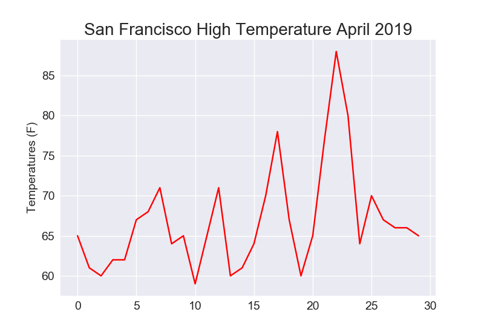

# California-Weather-DV (in progress)
California Weather Data Visualization

--------------------------------------------------------------------------------------------------------

This repository is solely used as practice (and as a reference) for data wrangling and visualization using real-world data. 

Using Python, I take the highest temperatures measured in April 2019 in San Francisco and plot them using matplotlib. I plan on using this method in future projects.

--------------------------------------------------------------------------------------------------------

Part 1: Visualizing specified data

