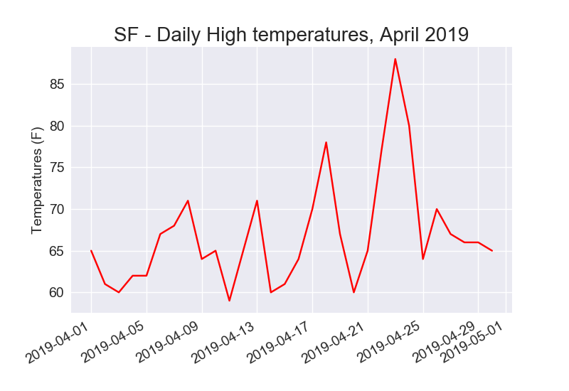
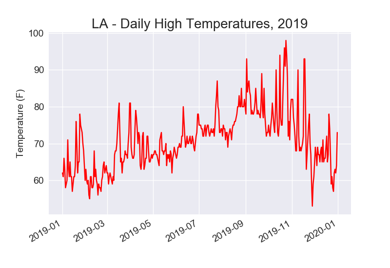

# California-Weather-DV
California Weather Data Visualization

--------------------------------------------------------------------------------------------------------

This data visualization side-project is based on a tutorial from Eric Matthes project-based programming book titled "Python Crash Course".

This repository is solely used as practice (and as a reference) for data wrangling and visualization using real-world data. 

Using Python, I take the highest and lowest temperatures measured in San Francisco and Los Angeles (2019) and plot them using matplotlib. This introduces the standard techniques used for plotting and visualizating data, and I plan on using this method in future projects.

--------------------------------------------------------------------------------------------------------

Part 1: San Francisco - Visualizing specified data (first image) and adding in the dates using datetime (second image)

 

--------------------------------------------------------------------------------------------------------

Part 2: Los Angeles - Plotting larger data sets

--------------------------------------------------------------------------------------------------------
